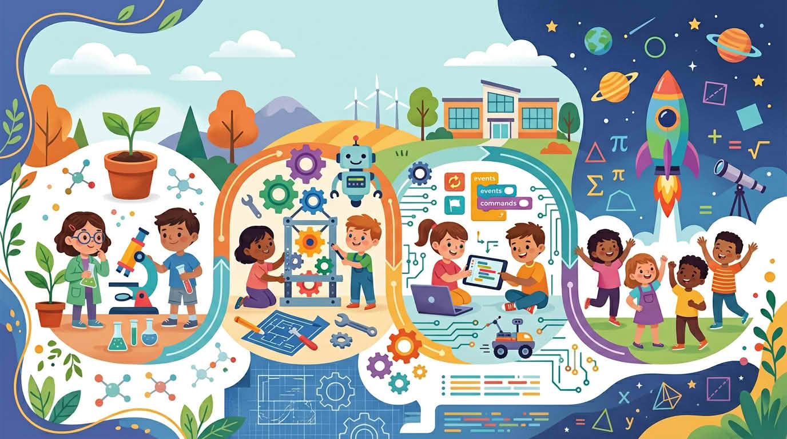

# Кратък увод в STEM

Следвайте тази дъга: **Въведение в курса**, **Какво е STEM**, **Защо STEM е важен**, **Какво се случва в STEM заниманията**, **Първо STEM преживяване**, после **Какво да направим след това**.

Всяка спирка е кратка нарочно — достатъчно да събуди любопитство, без да стане учебник. Когато една тема щракне, запишете един пример от своя ден; ще го използвате в последния урок.

STEM може да звучи като куп училищни предмети; в този курс го приемаме като **един начин на мислене**: забелязваш закономерности, питаш „а ако?“, и проверяваш идеите честно.
