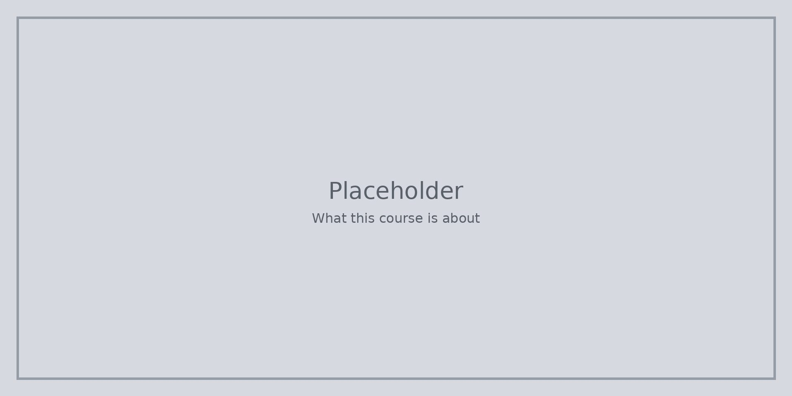

Този курс е за **STEM**. Буквите означават **наука**, **технологии**, **инженерство** и **математика**. Те се събират, когато питате, опитвате, строите и използвате числа, за да проверите идеите си.

Страниците са кратки нарочно. Когато нещо щракне, сесете един пример от своя ден. Ще го използвате пак по-късно.

