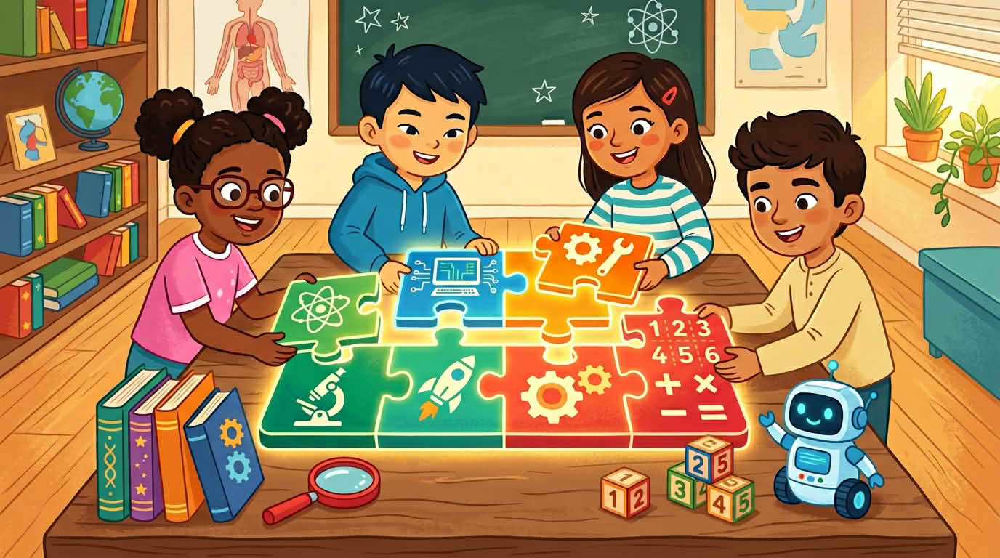

Здравейте! Този курс е за STEM. Буквите означават **наука**, **технологии**, **инженерство** и **математика**. Те се събират като части от пъзел: питате, опитвате, строите и използвате числа и закономерности, за да разберете света. Думите тук пасват на това как обикновено четат **деца от девет до дванадесет години** — къси изречения, закачки от живота.

Следва в този урок: защо **учудването** бие „вече съм най-умният“ и как вашите собствени истории могат да започнат нещата, без някой да се чувства съден.

