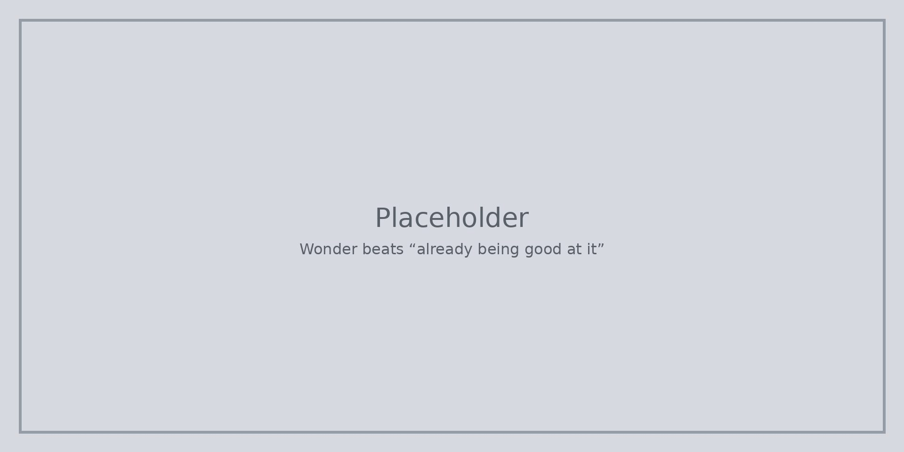

Не трябва да знаете всичко, преди да започнете. **Да сте любопитни** и да питате „а ако?“ е достатъчно за начало.

Грешките, докато се ориентирате, са нормални. Учете се от тях и бъдете добри към себе си и към другите.

