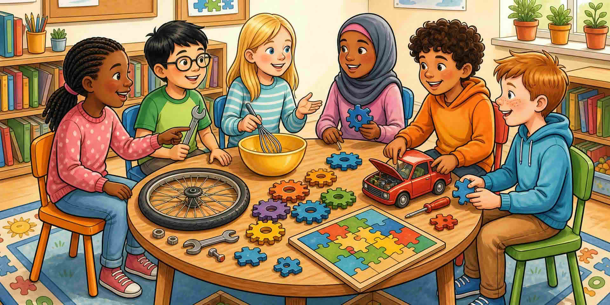

Сетете се за момент, в който сте се чудили как работи нещо, направили или поправили нещо, или решили пъзел. Тези моменти вече използват STEM навици.

Когато някой друг споделя, слушайте за искрата в историята му. Групата ще забележи повече примери, отколкото един човек сам.

