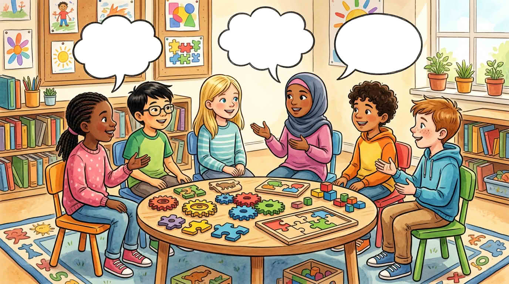

Сетете се за момент, в който сте се чудили как работи нещо, направили или поправили нещо, или разгадали пъзел. Тези моменти също са STEM-овски. Споделянето им помага на класа да учи от истински истории — без първият ден да стане състезание кой е „най-добър“ по наука или математика.

Когато някой друг споделя, **слушайте за искрата** в историята му, дори да е различна от вашата — така групите забелязват повече примери, отколкото един човек сам.

