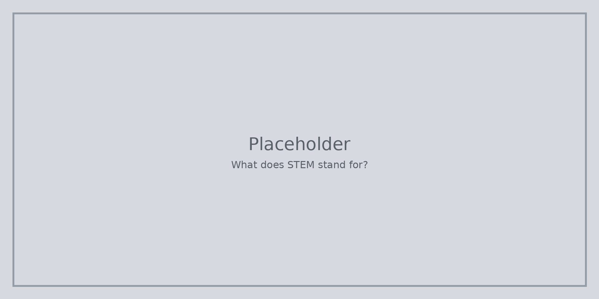

STEM означава **наука**, **технологии**, **инженерство** и **математика**. В този курс те са **един набор от инструменти** за разбиране на нещата, не четири заключени кутии.

**Науката** гледа какво се случва и какви доказателства имате. **Технологиите** са инструменти и системи, които хората използват. **Инженерството** означава да проектирате нещо, което работи в реалния живот. **Математиката** помага да забележите закономерности и да проверите дали едно твърдение е разумно.

