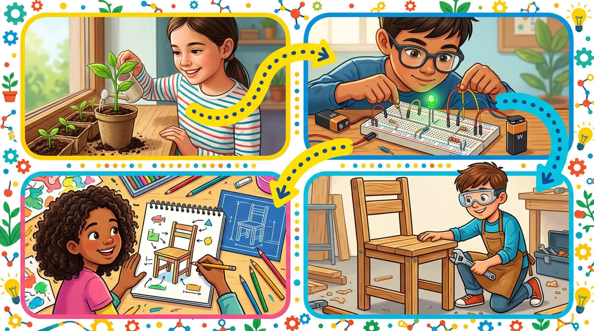

Закачете всяка буква за всекидневни неща — поникващи растения, малка верига, затягане на клатещ се стол — за да видите **кой вид мислене** пасва на този момент. Грижим се за **връзките**, не за наизустяване на твърди имена. Забележете кога да **погледнете отблизо**, да **скицирате план**, да **направите прост модел** или да **направите малко математика**, преди да навлизате по-дълбоко по-късно.

Бързи скици или няколко бележки в тетрадката могат да ви помогнат да **отбележите** кой режим сте ползвали — за да видите по-късно как расте собственото ви мислене.

