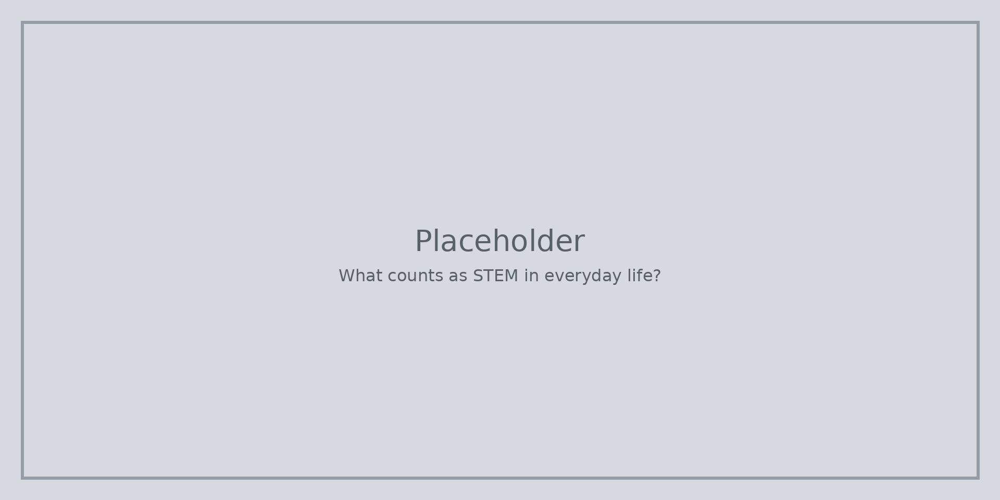

STEM не е само клубове по роботика и хубави лаборатории. Да проверите коя чаша държи водата студена, да гледате как расте растение или да поправите клатещ се стол също се броят.

Ако STEM ви е изглеждал „не е за мен“, забележете питането, опитването, строенето и проверката, които вече правите в готвенето, игрите, спорта или ръчната работа.

