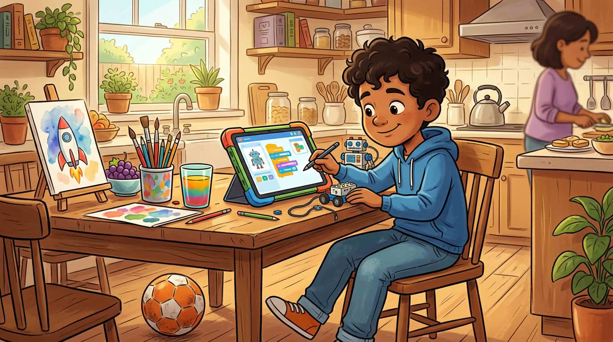

Ако STEM звучи „не е за мен“, забавете: **питане**, **опитване**, **строене** и **проверка** се появяват и в готвенето, Minecraft, спорта и ръчните проекти. Ще връзваме големите идеи към малки неща, които вече правите — не само към хубави лаборатории или дебели учебници.

Хора, които уважавате — треньори, роднини, създатели онлайн — често използват STEM навици **без** да ги наричат така; да назовете навика може да го направи **ваш**, не взет от плакат.

