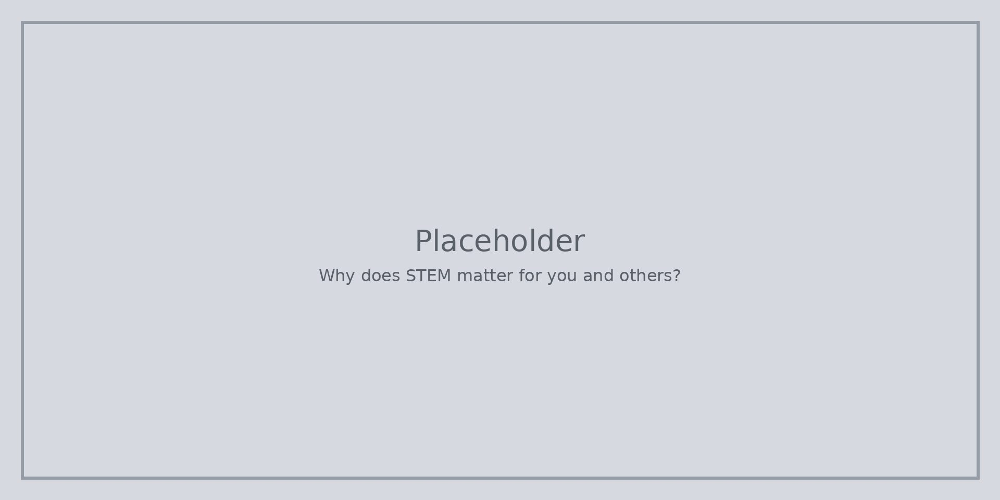

STEM мисленето се появява, когато говорим за здраве, енергия, телефони, сгради и пътища. Да забелязвате **добри доказателства** ви помага да следите новините и семейните разговори с повече увереност.

Не ви трябва научна работа по-късно, за да има това значение. Помага ви да участвате в свят, пълен с инструменти и твърдения.

