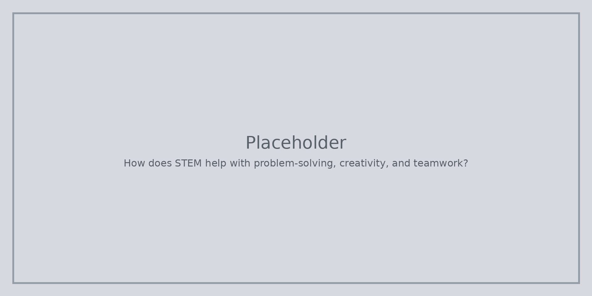

STEM задачите често започват с истински въпрос. Опитвате идеи, променяте ги и обяснявате какво се е случило. Това е **решаване на проблеми**.

Трябва също **въображение** (повече от един дизайн може да работи) и **екипна работа** (споделяне на задачи и слушане). Тези навици помагат в много предмети, не само в часа по наука.

