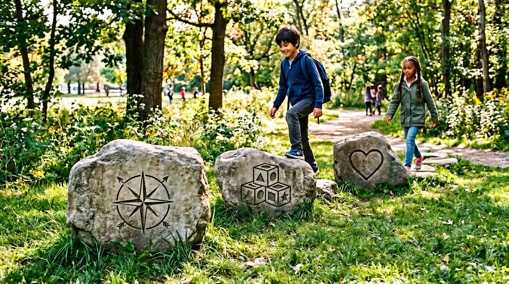

Нарочно този урок идва **след** добре дошли и **Какво е STEM**: първо се ориентирате, после учите буквите, **после** чувате защо изобщо има значение. Целта е да усетите защо тези **начини на мислене** си струват да се упражняват — и как това се връзва с това, което ще правите след това.

Ако нещо в този урок се усеща тежко, **спрете** и го свържете с едно нещо, което ви е грижа — животни, спорт, игри, изкуство — за да не е „защо STEM“ абстрактна домашна работа в главата ви.

