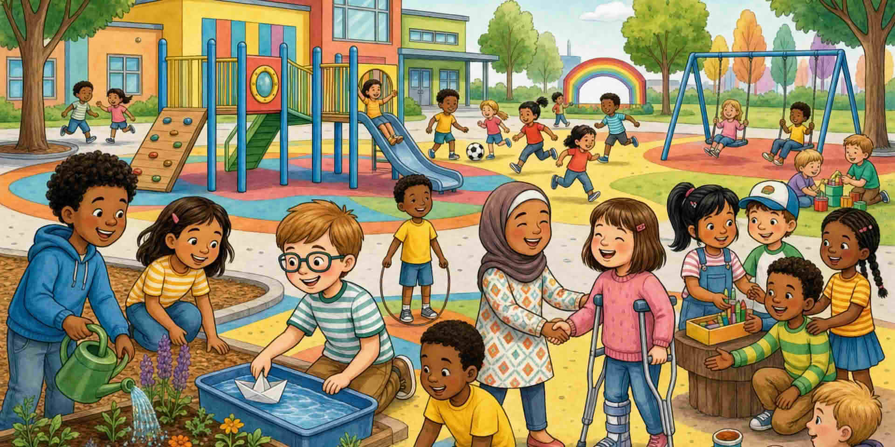

Хората използват STEM мислене за вода, храна, пътуване, здраве и климата. Можете да започнете малко: един въпрос, една проверка, едно подобрение.

Не всеки получава едни и същи инструменти или шансове. Да кажете това честно гради доверие. Подкрепяйте хората и пак назовавайте реалните пречки.

