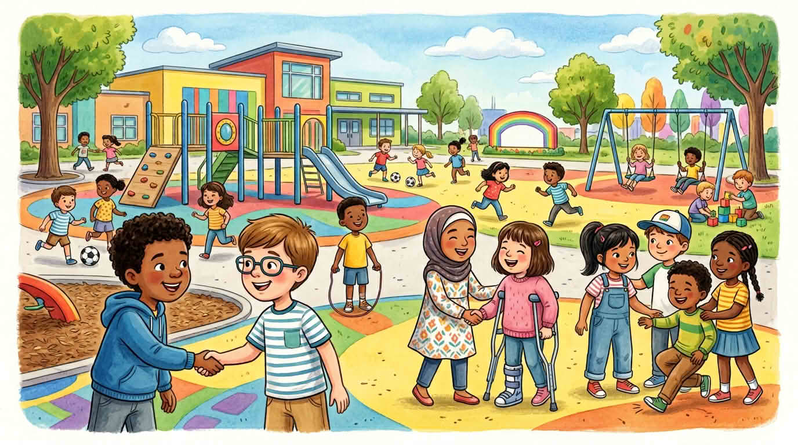

Не всеки получава едни и същи **инструменти**, **възрастни, които помагат**, **време** или **честни шансове да види хора като себе си** в STEM истории. Да кажете това честно **гради доверие**. Можете пак да подкрепяте всички и да мислите внимателно, като признавате реални пречки — не да ги криете зад лозунги за ентусиазъм.

**Работете по двойки** или в малки групи, когато можете — споделените проблеми стават по-малко страшни, а повече гласове означават повече идеи за **честни** пътища напред.

