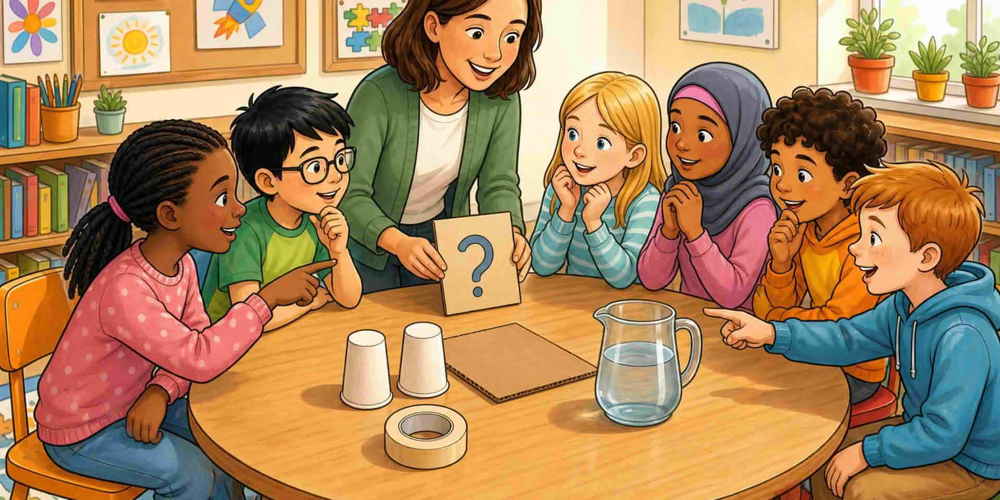

Силните STEM занимания обикновено започват с **въпрос, проблем, предизвикателство или нужда**. Вместо да започвате с дълъг списък факти, получавате ситуация, която ви кани да мислите.

Може да ви попитат как да преместите предмет по-лесно, кой материал държи водата студена или какъв дизайн пази яйце. На този етап питате, забелязвате, говорите какво вече знаете и предвиждате. Ако само следвате фиксирани стъпки без решения, заниманието може да е оживено — но е по-малко вероятно да е силно STEM учене.

