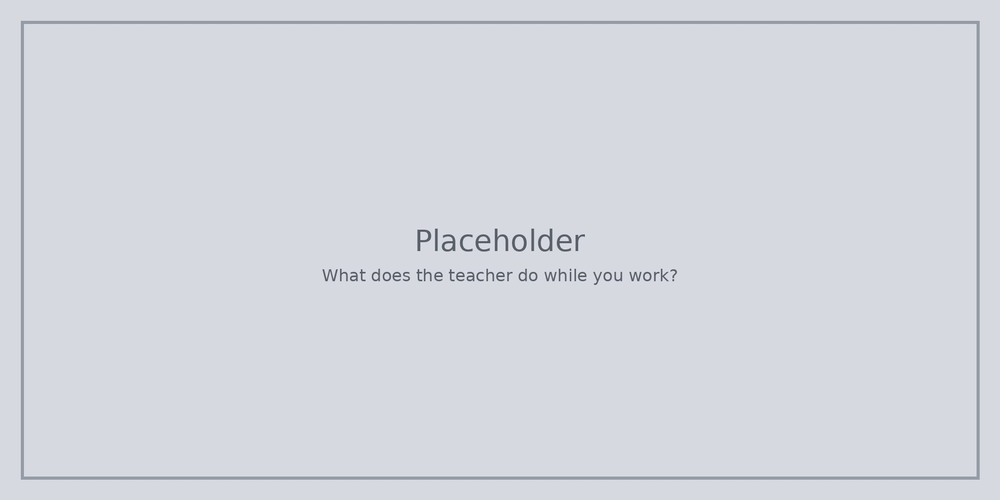

Работата на учителя не е да дава всеки отговор. Той държи стаята безопасна, задава въпроси и помага на екипите да останат добри и по задачата.

Полезните въпроси звучат така: Какво забелязвате? Защо мислите, че се случи това? Какво бихте променили след това? Мисленето остава ваше.

