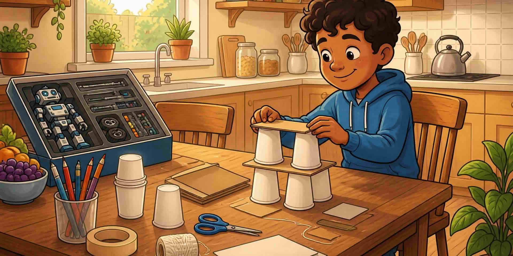

Започнете малко. Добрият първи STEM опит е въпрос, който разбирате, с материали, които вече имате. Хартиени мостове, кули, растения и „коя чаша остава студена“ са достатъчни.

Питайте: Ясен ли е въпросът? Мога ли да изпитам или да построя нещо? Имам ли време и неща за това?

