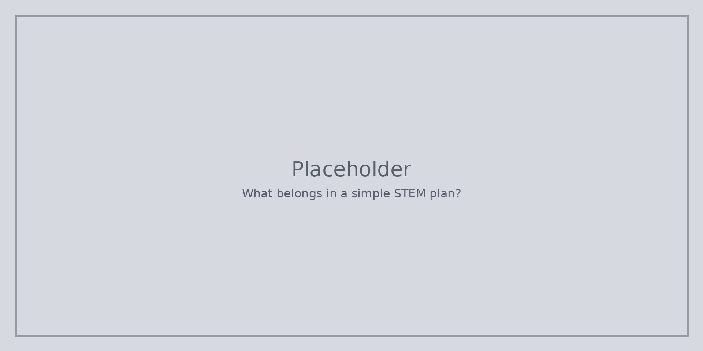

Простият план може да се събере на една страница: **цел**, **въпрос**, **материали**, **какво ще опитате** и **как ще разберете, че е проработило**.

Оставете време да изпитате и да промените нещо. Ако няма време за подобрение, ученето остава тънко.

