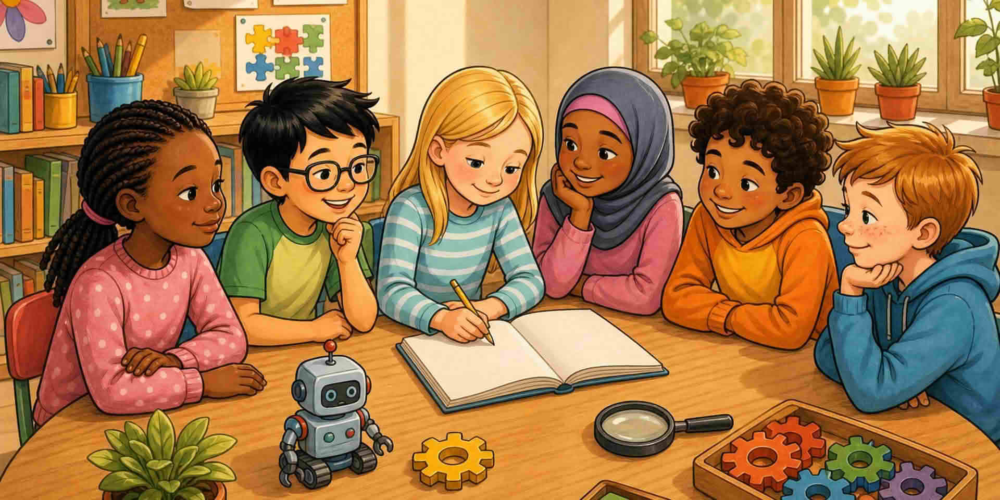

Вече имате начин да изберете малко предизвикателство, да напишете прост план и да го държите изпълним. След това ще изберете следваща стъпка, която наистина можете да опитате след този курс.

Ако планът ви все още се усеща огромен, разрежете го наполовина.

