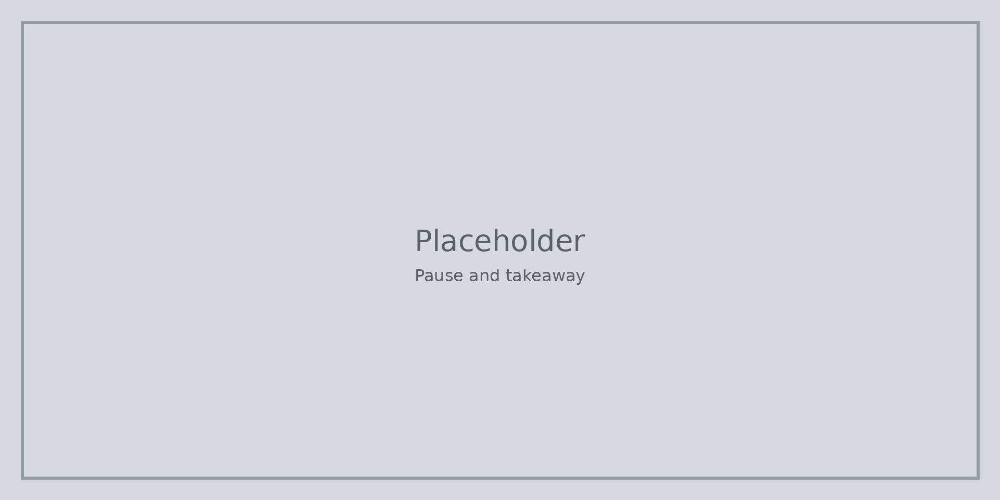

Преди **Какво да направим след това** трябва да можете да назовете начален въпрос, да изброите частите на прост план и да кажете един начин, по който бихте свили задачата, ако времето или материалите са оскъдни.

Последният урок превръща това в една лична следваща стъпка, за да не изчезне искрата, когато часът свърши.

