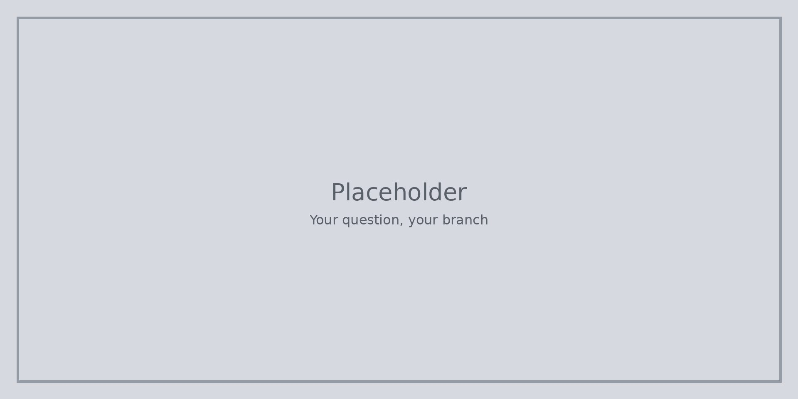

Питайте: **кой един въпрос искам да гоня след това?** Математически пъзели, правене на неща, програмиране, растения или нещо друго — не всички трябва да вървите по един и същи път.

Ако заседнете, назовете две „може би“ с партньор и изберете по-малко страшното, за да го изпитате първо.

