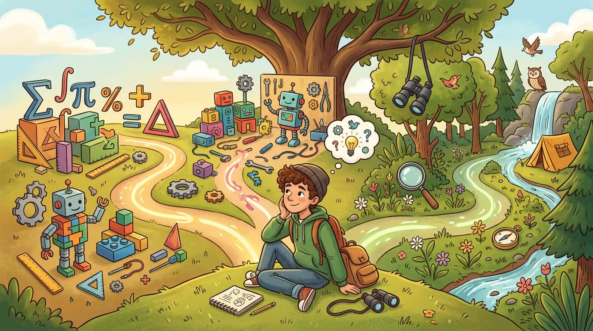

Забавете и питайте: **кой един въпрос искам да гоня след това?** Може математически пъзели, правене на неща, просто програмиране, гледане на животни и растения или нещо друго — **не всички трябва да вървите по един и същи път.** Изберете какво пасва на **вас**, с палец нагоре от учител или приятел, ако това помага.

Ако заседнете при избора, опитайте **двуминутни мозъчни атаки** с партньор: всеки назовава един „може би“ път, после избирате по-малко страшния, за да го **изпитате първо**.

