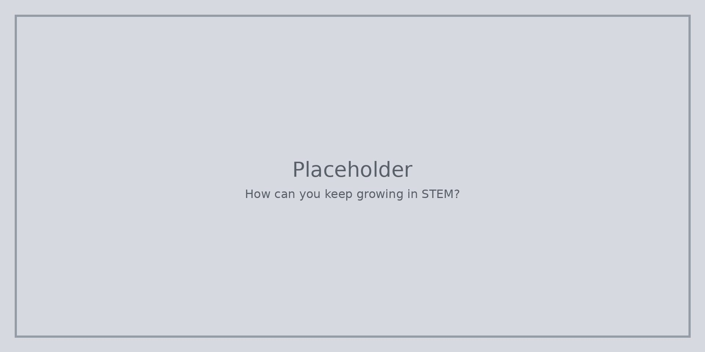

Не трябва да станете експерт тази седмица. Опитайте една нова задача, забележете какво се е случило и говорете с някого, който също опитва.

STEM може да изглежда различно в час, в клуб или у дома. Растежът означава да се приспособявате, не да копирате един перфектен проект.

